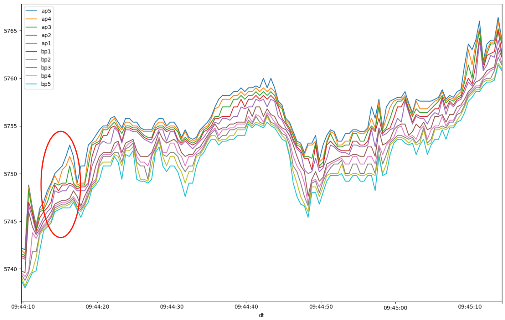
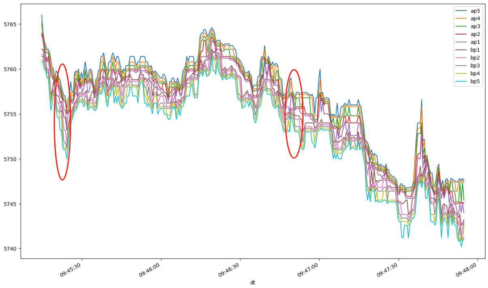

# Project 1
In this project, my objective is to predict the next 15-min and 30-min returns of the three stock index futures (both traded on China Financial Futures Exchange). IC represents the CSI 500 Index, IF represents the CSI 300 Index, and IH represents the SSE 50 Index. Both of them are major stock index futures contracts. In this project, I have only considered trading the main contracts, since liquidity is important for frequent position adjustments.

## Data preparation
For calculations of the prediction signal, I combined level-2 data of main contracts day by day for both underlyings. Sample data for a single trading day can be found in directory “sample_snapshot_data/”. The update frequency of Level-2 market data is once every 500 milliseconds. Level-2 data includes the following information: contract name, latest price, trading volume, open interest, bid price, ask price, bid volume, and ask volume.

Definitions of the main columns: ap1, ap2, ..., ap5 representing ask_price1, ask_price2, ..., ask_price5. bp1, bp2, ..., bp5 representing bid_price1, bid_price2, ..., bid_price5.

## Idea generation
The momentum effect in stock index futures has been widely discussed. I have met some quantitative traders achieved stable returns through intraday trading strategies incorperating momentum effect. The success of these strategies heavily relies on rapid response to market dynamics. That is why I would like to find a signal which target on short-term price fluctuations. As the prediction signal probably changes rapidly, the corresponding strategy would be a high-turnover strategy.

I look into the high-frequency data to observe the characteristics of the limit order book during the formation of price trends. And I found that when the mid-price is stable, (ask_price5 - ask_price1) and (bid_price1 - bid_price5) tend to stabilize within a relatively small range. This is probably because investors do not have significant disagreements on the future price movements. However, when the mid-price begins to show an upward trend, the spread between ask_price1 and ask_price5 tends to increase. Similarly, as the mid-price begins to show a downward trend, the spread between bid_price1 and bid_price5 tends to increase. It is reasonable to pay more attention to the price momentum when (ask_price5 - ask_price1) or (bid_price1 - bid_price5) increases.

The following two figures are examples:

(ask_price5 - ask_price1) or (bid_price1 - bid_price5) might not has a strong predictive power, while we can combine them with another basic predictor. In this case, I use an improved version of the RSI indicator, which is a momentum factor suitable for predicting short-term trends. 

## Expression of the price prediction signal

Define an improved version of the RSI indicator as:

$$
rs(price, N) = ema(ReLU(diff(price,1)), N) / ema(abs(diff(price,1)), N)
$$

The operator ema() is for "Exponential Moving Average", and diff() is equivalent to numpy.diff. N is the window size for rolling calculation.

